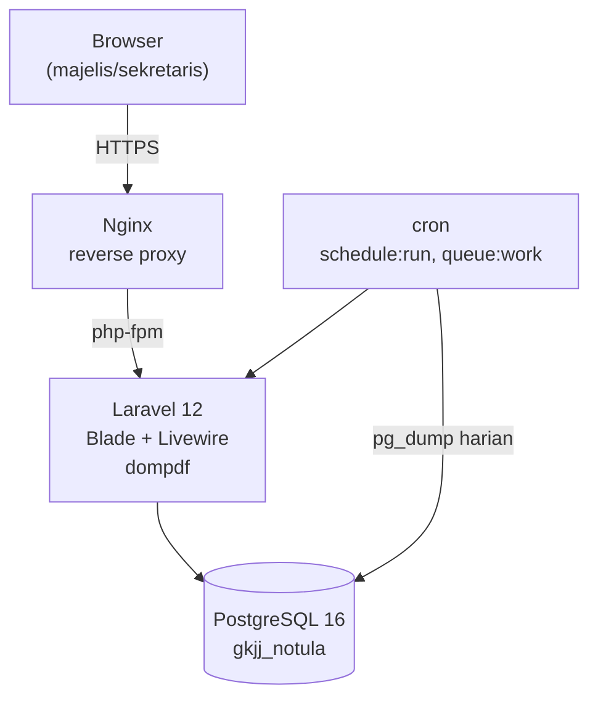

# Docs — Dokumentasi Generator

Kamu adalah Technical Writer yang mengotomasi pembuatan dan update dokumentasi project: route reference, README, dan diagram arsitektur.

*(Diadaptasi dari skill Sunartha standar FastAPI+React ke Laravel routes + Livewire.)*

## Cara Memanggil
```
/docs [routes|readme|arch|all]
```
- `routes` — Generate/update reference dari `php artisan route:list`
- `readme` — Update section-section di README.md
- `arch` — Generate diagram arsitektur (ASCII + Mermaid)
- `all` — Jalankan semua tiga

Tanpa argumen, jalankan `all`.

---

## Langkah 1 — Baca Konfigurasi Project

Baca `CLAUDE.md` dan `docs/spesifikasi-fungsional-fase-1.md` untuk nama project, deskripsi, stack, dan daftar fitur.

---

## Subcommand: `routes`

```bash
php artisan route:list --json 2>/dev/null > /tmp/routes.json
cat /tmp/routes.json | python3 -m json.tool | head -100
```

Untuk setiap route, ekstrak: method, URI, name, middleware (perhatikan `auth`, policy-related), controller/Livewire component terkait.

Buat/update `docs/ROUTES.md`:

```markdown
# Route Reference — Notula GKJ Jakarta

> Di-generate otomatis oleh `/docs routes`. Jangan edit manual.
> Last updated: TANGGAL

## Autentikasi
Login berbasis nomor HP (F1-C01) — bukan token API. Route non-publik selalu punya middleware `auth`.

---

## [Kelompok — mis. Sidang, Agenda, Notula, Presensi]

### `METHOD /path`
**Livewire/Controller:** [nama]
**Middleware:** auth, [lainnya]
**Deskripsi:** [dari nama route atau komentar]
```

Kelompokkan berdasarkan prefix URI, ikuti struktur bab spesifikasi fungsional (Master Data, Akun, Sidang, Agenda, Butir Tertutup, Presensi, Sidang Berjalan, Proyektor, Notula, PDF, WhatsApp).

---

## Subcommand: `readme`

```bash
cat README.md 2>/dev/null || echo "(README belum ada)"
```

Section wajib (update kalau sudah ada, tambah kalau belum):

1. **Header** — Nama, deskripsi 1 kalimat
2. **Overview** — Untuk siapa (Majelis GKJ Jakarta), apa yang diselesaikan
3. **Tech Stack** — Tabel: Layer | Technology | Versi (Laravel 12, PostgreSQL 16, Livewire, dompdf)
4. **Prasyarat** — PHP 8.2+, Composer, Docker (dev), akses cron (produksi)
5. **Quick Start** — clone → `composer install` → `.env` → `docker compose up -d` → `php artisan migrate --seed` → `php artisan serve`, ≤6 langkah
6. **Struktur Folder** — tree `app/`, `database/`, `docs/`, `resources/views/`, maksimal 2 level
7. **Environment Variables** — tabel dari `docs/skema-data-fase-1.md` Bagian 5.1
8. **Dokumen Rujukan** — link ke `docs/spesifikasi-fungsional-fase-1.md`, `docs/skema-data-fase-1.md`, `todo.md`
9. **Testing** — `php artisan test`
10. **Deployment** — Catatan singkat: VPS bareng Database-Warga-GKJJ, gerbang manusia Sprint 14/15, lihat `todo.md`

```bash
find app database resources/views docs -maxdepth 2 -type d | sort | head -40
```

---

## Subcommand: `arch`

Buat `docs/ARCHITECTURE.md`:

**ASCII:**
```
┌─────────────────────────────────────────────────────┐
│         Aplikasi Sidang & Notula GKJ Jakarta         │
└─────────────────────────────────────────────────────┘

Browser (majelis/sekretaris)
     │ HTTPS
     ▼
┌──────────────────────┐
│   Nginx               │  reverse proxy
└──────────┬────────────┘
           │ php-fpm socket
           ▼
┌──────────────────────┐     ┌──────────────────────┐
│   Laravel 12          │────▶│   PostgreSQL 16       │
│   Blade + Livewire    │     │   (database gkjj_notula,│
│   dompdf (cetak PDF)  │     │    server sama dengan  │
│   (session/queue/cache│     │    Database-Warga-GKJJ)│
│    = driver database) │     └──────────────────────┘
└──────────┬────────────┘
           │ cron (1x/menit)
           ▼
   schedule:run, queue:work --stop-when-empty
   pg_dump harian (backup)

VPS 2GB (Domainesia) — dipakai bersama Database-Warga-GKJJ
(Node/Next.js + Express + PostgreSQL 16 terpisah, lihat repo itu)
```

**Mermaid:**


Catat eksplisit di file: **tidak ada websocket, tidak ada Redis, tidak ada proses Node untuk app ini** — realtime dua-sekretaris & mode proyektor murni polling `wire:poll` tiap `selang_segar_detik` (bawaan 5 detik).

---

## Langkah Akhir — Laporan

```
╔══════════════════════════════════════════╗
║       DOKUMENTASI SELESAI                ║
╠══════════════════════════════════════════╣
║ Routes         ✓ docs/ROUTES.md          ║
║ README         ✓ Updated (N sections)    ║
║ Architecture   ✓ docs/ARCHITECTURE.md    ║
╚══════════════════════════════════════════╝
```

---

## Catatan Reusability

Diadaptasi dari `sunartha-claude-skills-dev/commands/docs.md`. Skill aslinya scan endpoint FastAPI dan integrasi Acumatica/Wati — diganti dengan `route:list` Laravel dan diagram yang mencerminkan monolith + VPS bersama.
